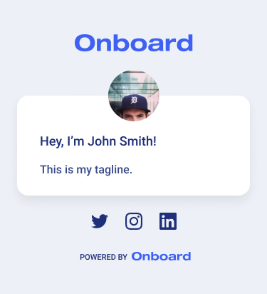

# Onboard Engineering Code Challenge

## Prototype Challenge

**Goal:**

Showcase your ability to produce a basic prototype for a user profile page and/or API endpoint. Choose either Full Stack, Backend or Frontend section below based on the role you are applying for.

**Deliverables:**

- Publish your project via (Heroku)[https://heroku.com/], GitHub pages, or other platform with a publicly accessible URL to view the code challenge
- Share your source code on Github.
- You may use any frameworks/databases/dependencies, etc. and feel free to add any other helpful or useful features to showcase your skills. Good luck!

**Prototype Details:**

_Design:_



> Note: Assets included in this repository in the `assets` folder.

_JSON data example:_

```json
{
  "id": 5,
  "profile": {
    "id": 5,
    "linkedin_url": "https://www.linkedin.com/company/onboardio/",
    "twitter_url": "https://www.twitter.com/onboardio/",
    "instagram_url": "https://www.instagram.com/onboardio/",
    "website_url": "https://onboard.io",
    "bio": "This is my tagline.",
    "job_title": "Title"
  },
  "avatar": "https://assets.onboard.io/assets/a/5/5/fswnuakkcn.jpg",
  "first_name": "John",
  "last_name": "Smith",
  "name": "John Smith",
  "created_at": "2020-10-01T19:40:40Z"
}
```

## Full Stack

If you are applying for a full stack role, you should do both the backend and frontend sections.

## Backend

Use the language you are most comfortable with. Preferably, use one of the following from Onboard's tech stack:

- Python/Django/DRF
- Go
- NodeJS
- Serverless

**Requirements:**

- Create a database table / model that stores user profile information using the JSON data provided as reference.
- Create an API endpoint that returns the data in JSON format.
- Endpoint should be publicly accessible.

## Frontend

Use the language you are most comfortable with. Preferably, use one of the following from Onboard's tech stack:

- React.js
- JSX

**Requirements:**

- Create a basic page that shows profile data based on the provided design and JSON Data.
- The Onboard logo and "Powered by Onboard" logo should be linked to [https://onboard.io](https://onboard.io) in a new window.
- The social icons should link to the corresponding social URL from the profile data.
- All assets are included in this repository in the `assets` folder.
